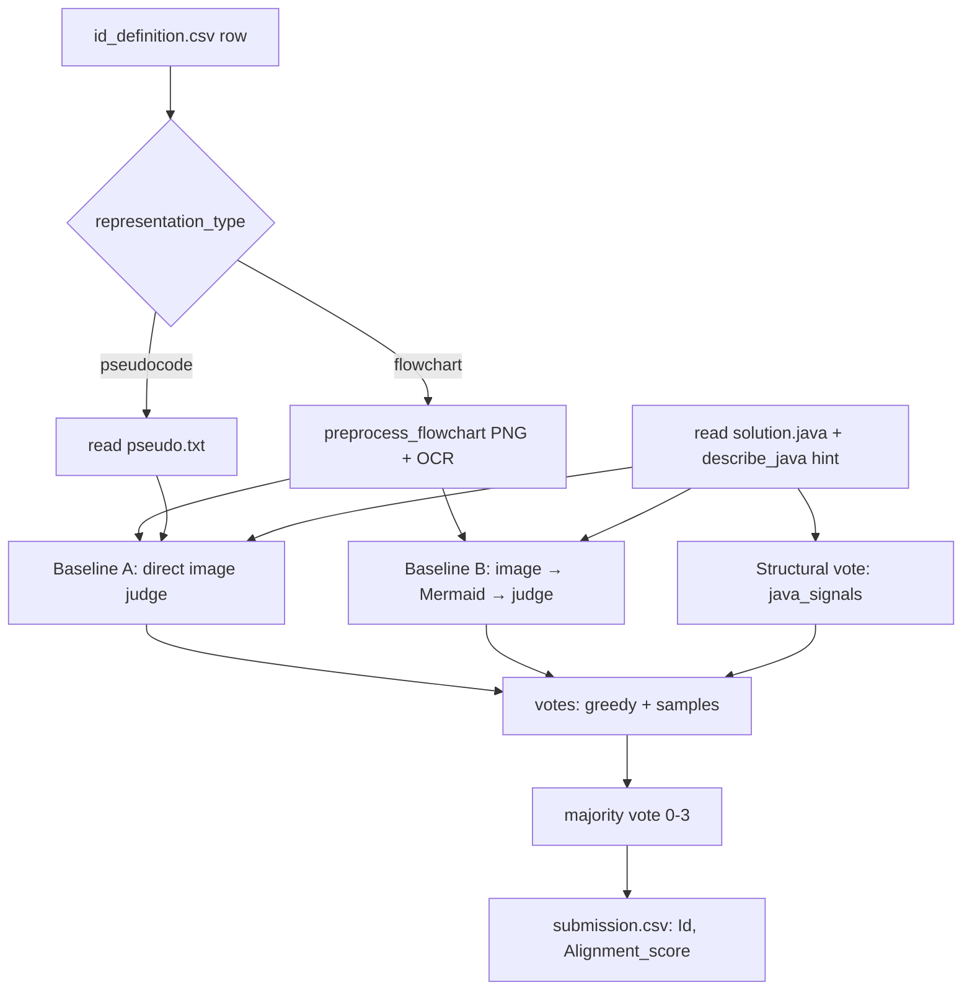

# Pipeline — how the alignment verifier works

This document explains the system end to end: what problem it solves, how a single
case flows through the code, and where each design decision lives. Read it alongside
the module files it references.

---

## 1. The task

For each case the organizers give three artifacts:

```
case_XX/
  flowchart.png     # the design, as an image (often Thai labels)
  pseudo.txt        # the design, as text (often Thai)
  solution.java     # the implementation (English)
```

We must output an **alignment score 0–3** for two independent comparisons:

- `flowchart.png` ↔ `solution.java`
- `pseudocode.txt` ↔ `solution.java`

| Score | Meaning | Rubric |
|:---:|---|---|
| 0 | Inconsistent | Clearly different, or a different algorithm. |
| 1 | Weakly consistent | Some parts match; several important differences. |
| 2 | Mostly consistent | Main approach matches; minor differences / missing detail. |
| 3 | Fully consistent | Concept, steps, conditions, and order all match. |

The grade is about **behavior, not syntax** — variable names and formatting may differ.
Leaderboard metric is **exact-match accuracy**, which is why the pipeline favors decisive,
stable answers (self-consistency voting) over hedging.

---

## 2. High-level flow



One model (**Qwen2.5-VL-7B-Instruct**) plays every role: it judges the image directly
(Baseline A), transcribes the flowchart to Mermaid and judges that (Baseline B), and reads
pseudocode as text. There is no trained classifier — the labeled set is tiny (33 cases), so
labels are used as **few-shot anchors** and a **validation set**, not training data. For
pseudocode cases (no image) A and B collapse into a single text judge.

---

## 3. Module map

| File | Responsibility |
|---|---|
| `config.py` | All paths, model id, decoding params, pipeline toggles, HF env. |
| `parser/java_signals.py` | Structural facts about the Java + rule-based fallback score. |
| `feature/image_prep.py` | In-memory flowchart cleanup + optional OCR. |
| `llm/prompt.py` | Rubric system prompt, per-task templates, few-shot builder. |
| `predict.py` | Data access, model wrapper, self-consistency, scoring, CSV output. |
| `notebook.ipynb` | Kaggle entry point (`git clone → pip install → python predict.py`). |

---

## 4. Step by step

### 4.1 Data access — `predict.py`

- **Case discovery** (`_build_case_index`, `find_case_dir`): recursively indexes every
  `case_*/` folder under `DATA_DIR`, so any nesting works — flat, `train/`+`test/`, or the
  double-nested `training/training/` + `test/test/` the sample ships with. The index is
  built once and cached.
- **Readers**: `read_java`, `read_pseudo` (accepts `pseudo.txt` or `pseudocode.txt`),
  `flowchart_path`. Files are read UTF-8 with `errors="ignore"` so stray encoding bytes
  never crash a run.
- `DATA_DIR` defaults to `datasets/` and is overridable with the `ALIGN_DATA_DIR`
  environment variable (e.g. a Kaggle dataset mount).

### 4.2 Java structural signals — `parser/java_signals.py`

`extract_java_signals` counts inputs, loops, branches, outputs, arithmetic ops, and array
use. It prefers a real AST via `javalang` when installed, and falls back to carefully
scoped regexes (comments/strings stripped first; the `String[] args` in `main` is
deliberately **not** counted as array use; only actual `next*()`/`readLine()` calls count
as inputs).

Two consumers:
- `describe_java(code)` → a one-line **hint** injected into the prompt
  (`"Detected in Java: 1 input read(s), 1 loop(s), 1 branch/condition(s), ..."`) so the
  model grounds its comparison in facts rather than guessing.
- `fallback_score_from_signals(java, design_text)` → a coarse 0–3 estimate used **only**
  when the LLM output can't be parsed even after a retry. It compares the Java's control-flow
  shape against loop/branch/input/output keywords (English **and** Thai) found in the design.

### 4.3 Flowchart preprocessing — `feature/image_prep.py`

`preprocess_flowchart(path)` returns an RGB `PIL.Image`, never touching the file on disk:

1. **Flatten** RGBA/palette onto white.
2. **Auto-crop** whitespace to the ink bounding box, then re-pad ~24 px.
3. **Upscale** small charts (Lanczos) so node text is legible; cap the long side to bound
   the visual-token count on a T4.
4. **Enhance** mildly: grayscale → autocontrast → light unsharp. Deliberately **not**
   binarized — hard thresholds eat thin arrowheads. Result kept as 3-channel RGB.

`ocr_flowchart(img)` (optional, `USE_OCR`) extracts node text with Tesseract (`eng+tha`) or
PaddleOCR and returns `""` if no engine is available — so OCR is a pure bonus, never a
hard dependency. The detected text is passed to the model beside the image so it doesn't
misread Thai labels or operators.

**Debugging OCR on Kaggle:** set `ALIGN_DEBUG_OCR=1` (or `config.DEBUG_OCR = True`) to print
one greppable line per flowchart as it is scored:

```
ocr:case_34/flowchart.png : "เริ่มต้น | รับค่า a, b, c | a >= b และ a >= c | Yes | ..."
```

Empty output prints `"<empty — no OCR engine or no text>"`, which is your cue to install
Tesseract (`!apt-get install -y tesseract-ocr tesseract-ocr-tha && pip install pytesseract`).
In the notebook, run `import os; os.environ['ALIGN_DEBUG_OCR']='1'` before the `!python
predict.py ...` cell, or run `!ALIGN_DEBUG_OCR=1 python predict.py --validate`.

### 4.4 Prompt construction — `llm/prompt.py`

The judge is asked to reason, then emit **strict JSON**. `build_messages` assembles a chat
message list:

1. **System prompt** (`system_prompt`) — the 0–3 rubric verbatim, the behavior-over-syntax
   rule, and the JSON output contract. An optional persona sentence (strict/lenient) can be
   added for ensemble diversity.
2. **Few-shot anchors** (`build_fewshot_messages`) — one labeled example per score level,
   pulled from the train CSV (see 4.5). Rendered text-only to keep the token budget small.
3. **The case turn**:
   - `flowchart_user_turn` — a multimodal turn carrying the preprocessed **image**, the
     Java, the hint, and any OCR text.
   - `pseudocode_user_turn` — a text-only turn with the pseudocode, Java, and hint.

The requested JSON is a **chain-of-check**: summarize the Java → summarize the design →
compare six dimensions (`input, output, order, loop, condition, computation`) → list
mismatches → map findings to `final_score`.

`transcribe_flowchart_turn` supports an optional **two-pass** mode (`TWO_PASS`): first ask
the VLM to transcribe the flowchart into normalized text, then score that text with the same
comparison core — decoupling vision errors from grading.

### 4.5 Few-shot anchors — `predict.build_fewshot`

Uses a **curated contrastive set** (`config.FEWSHOT_CASE_IDS`): four real train cases from the
*same* problem (the "sum 1..n" group) whose Java scores 0/1/2/3 respectively. Because the design
is identical across them, the anchors teach the model that the score is driven by **Java
fidelity**, and calibrate the crucial boundaries — a wrong loop bound is a 2, a wrong loop body
is a 1, a down-counting loop is a 0. Each anchor renders as a user turn (pseudocode design +
Java + hint) followed by a score-appropriate reasoning + JSON demonstration. During `--validate`
these anchor cases are excluded from the accuracy (`EXCLUDE_FEWSHOT_FROM_VALIDATION`) to avoid
leakage; at test time (case_34+) there is none.

### 4.6 The model wrapper — `predict.Judge`

- Loads `Qwen2.5-VL-7B-Instruct` with `torch_dtype=float16` and
  `attn_implementation="sdpa"` — the two settings that matter on T4 (Turing has no bf16 and
  no FlashAttention-2). `device_map="auto"` with `max_memory` spreads it across both T4s;
  `LOAD_IN_4BIT` swaps in a bitsandbytes 4-bit load (~7 GB) if fp16 + image tokens OOM.
- Internet-on by default: `MODEL_DIR` is a HF repo id and weights download on first call.
  Set `ALIGN_OFFLINE=1` + a local `ALIGN_MODEL_DIR` for an offline run.
- `generate(messages, sample)` renders the chat template, runs `process_vision_info` from
  `qwen_vl_utils`, and decodes only the newly generated tokens.

### 4.7 Scoring one case — `predict.score_case` (ensemble)

A flowchart score is a **majority vote over three voters**: Baseline A (direct image judge),
Baseline B (image→Mermaid→judge), and the rule-based structural check. Each baseline casts a
greedy vote plus `SAMPLES_PER_BASELINE` sampled votes (self-consistency). A pseudocode case has
no image, so A and B collapse into one text judge.

```
read java + hint
if flowchart:  image = preprocess;  ocr_text = ocr (if USE_OCR)
else:          pseudo_text = read pseudo

votes = []
# Baseline A (USE_BASELINE_A): direct image / text judge
for persona in personas:                          # base persona sampled; extras greedy-only
    votes += collect_votes(build_A(persona), SAMPLES_PER_BASELINE if base else 0)
# Baseline B (USE_BASELINE_B, flowchart only): perception once, then reason over Mermaid
if flowchart:
    mermaid = extract_mermaid(generate(flowchart_to_mermaid_turn(image, ocr)))   # cached
    votes += collect_votes(build_B(mermaid), SAMPLES_PER_BASELINE)
# Structural vote (USE_STRUCTURAL_VOTE)
votes += [ fallback_score_from_signals(java, ocr_or_pseudo) ]

if no votes parsed: return fallback_score_from_signals(...)
return majority(votes)                    # ties break toward Baseline A's greedy vote
```

`_collect_votes` does one greedy pass (with a single parse retry) + N sampled passes over the
same messages; `_majority` picks the mode, tie-breaking toward the greedy anchor. The Mermaid
transcription is generated once and reused across Baseline B's votes.

**`parse_score`** is defensive: it looks for `"final_score": N`, then tries to load the whole
JSON object, then falls back to the last standalone `0–3` in the text. This tolerates markdown
fences, extra prose, and minor JSON breakage.

### 4.8 Outputs — `predict.run_submission` / `run_validation`

- **Submission**: iterate `id_definition.csv` (columns normalized to lowercase), route each
  row by `representation_type`, score it, and write `submission.csv` with columns exactly
  `Id,Alignment_score` in the original order. An assertion guarantees every score ∈ {0,1,2,3}.
- **Validation**: score every labeled train row and print
  `EXACT-MATCH ACCURACY: XX.X%`, a per-representation-type breakdown (flowchart vs
  pseudocode), and a 4×4 confusion matrix. Use `--dry-run N` to check the first N rows fast.

---

## 5. Configuration cheat-sheet (`config.py`)

| Setting | Default | Effect |
|---|---|---|
| `ALIGN_DATA_DIR` (env) | `datasets` | Where the CSVs and case folders live. |
| `MODEL_DIR` / `ALIGN_MODEL_DIR` | `Qwen/Qwen2.5-VL-7B-Instruct` | HF repo id (online) or local path (offline). |
| `ALIGN_OFFLINE` (env) | `0` | `1` forces HF offline mode. |
| `LOAD_IN_4BIT` | `False` | 4-bit quantized load if fp16 OOMs. |
| `USE_BASELINE_A` | `True` | Direct image (flowchart) / text (pseudocode) judge. |
| `USE_BASELINE_B` | `True` | Two-stage: image → Mermaid → judge (flowchart only). |
| `USE_STRUCTURAL_VOTE` | `False` | Rule-based vote (off — it skewed the vote to 0/3). |
| `SAMPLES_PER_BASELINE` | `2` | Sampled votes per baseline (on top of its greedy vote). |
| `TIE_BREAK_TOWARD` | `2` | Ties in the majority vote break toward this score. |
| `FEWSHOT_CASE_IDS` | sum group | Real contrastive anchor cases (scores 0/1/2/3). |
| `DEBUG_MERMAID` / `ALIGN_DEBUG_MERMAID` | `False` / `0` | Print the generated Mermaid per case. |
| `N_SAMPLES` / `SAMPLE_TEMPERATURE` | `5` / `0.7` | Self-consistency (non-ensemble path). |
| `USE_OCR` | `False` | OCR augmentation (off — Thai output was garbage/redundant). |
| `DEBUG_OCR` / `ALIGN_DEBUG_OCR` (env) | `False` / `0` | Print `ocr:<case>/flowchart.png : "…"` per file. |
| `TWO_PASS` | `False` | Transcribe flowchart → text, then score. |
| `USE_FEWSHOT` / `N_FEWSHOT` | `True` / `4` | Labeled anchors per prompt (aim one per score level). |
| `USE_PERSONAS` | `False` | Add strict/lenient votes to the ensemble. |
| `MIN_PIXELS` / `MAX_PIXELS` | 256·28² / 1280·28² | Visual-token bounds. |

---

## 6. How to run

```bash
# Local (or any machine with the data + a GPU)
python predict.py --validate --dry-run 4   # sanity check, verbose
python predict.py --validate               # train accuracy % + within-1 + confusion matrix
python predict.py --validate --baseline A  # measure a single config: A | B | AB
python predict.py --validate --baseline B
python predict.py --validate --baseline AB
python predict.py                          # full submission -> submission.csv
```

`--baseline {A,B,AB}` overrides the ensemble toggles for one run so you can compare Baseline A
(image), Baseline B (Mermaid), and A+B on the train set and keep the winner. The validation
summary also prints **within-±1 accuracy** and the **majority-class prior** (the bar to beat).

On Kaggle (GPU T4 ×2, Internet On) `notebook.ipynb` clones the repo, installs
`transformers accelerate qwen-vl-utils javalang`, and runs the same commands. The model
downloads from Hugging Face on the first call (~16 GB). If `datasets/` is not committed,
attach the competition data as a Kaggle input and set `ALIGN_DATA_DIR` to its mount.

---

## 7. Why this shape

- **LLM-as-judge, not a trained classifier** — 33 labeled cases is far too few to train on;
  it's enough to anchor and validate a strong prompt.
- **Chain-of-check + strict JSON** — forces the model to compare the same six dimensions
  every time and makes the score trivially parseable.
- **Self-consistency majority vote** — directly buys exact-match accuracy, the leaderboard
  metric, by smoothing out single-sample noise.
- **Structural hints + OCR** — cheap, deterministic grounding that keeps the model honest
  about what the Java and the flowchart actually contain.
- **Rule-based fallback** — guarantees every row gets a valid 0–3 even if a generation is
  garbled, so a submission is never missing rows.
