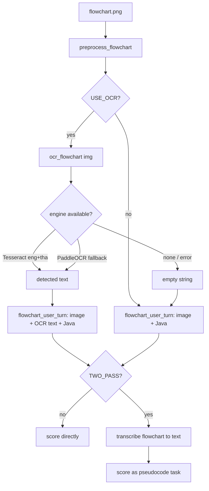

# Prompt & OCR flow

A focused deep-dive on the two parts that most affect accuracy: **how the prompt is
built** (`llm/prompt.py`) and **how flowchart OCR flows into it** (`feature/image_prep.py`
+ `predict.score_case`). For the whole-system overview see `pipeline.md`.

---

## Part A — The prompt

### A.1 What the model is asked to do

The judge grades **step-by-step / structural correspondence**, not "do both solve the
problem." This is the crux: two programs can compute the same result through different
control-flow and still score 0. The prompt is engineered to enforce that altitude.

Concrete example the prompt is built around (real `case_01`):

| | Design (flowchart/pseudo) | Java code | Human score |
|---|---|---|---|
| Structure | `if a>=b AND a>=c → a` … (each candidate vs both others) | nested pairwise `if(a>b){if(a>c)…}` | **0** |
| Same output? | yes (max of 3) | yes (max of 3) | — |

Same output, different decision structure → **inconsistent**. A model grading semantic
equivalence would wrongly say 3; the prompt exists to prevent that.

### A.2 Message layout

`build_messages(...)` returns a chat list in this order:

```
[ system ]                      # rubric + principles + Thai guide + output contract
[ few-shot user/assistant ]*    # one calibrated example per score level (0/1/2/3)
[ case turn ]                   # flowchart image (+OCR) OR pseudocode text, + Java + hint
```

### A.3 The system prompt — four blocks

Assembled by `system_prompt(persona)` from named constants:

1. **`RUBRIC`** — the 0–3 scale, worded so 0 explicitly covers "same output via a different
   structure," and 2 covers "same structure, only minor differences (`>` vs `>=`)."
2. **`GRADING_PRINCIPLES`** — the how-to-compare block. Tells the model to check inputs,
   the sequence of operations, the *decision structure* (how many decisions, what each
   tests), loops (kind/count/stop), and outputs; lists structural patterns that must score
   low (nested pairwise vs combined condition; chained else-if vs independent ifs; different
   loop stop condition); and lists what counts as merely *minor* (operator/threshold, an
   equivalent off-by-one, variable names, formatting).
3. **`THAI_GUIDE`** — a Thai→English vocabulary map (เริ่มต้น=start, รับค่า=input,
   แสดงผล/แสดงค่า=print, ถ้า=if, มิฉะนั้น=else, และ=and, หรือ=or, …) and the rule that a
   decision diamond's **Yes/ใช่** branch = condition TRUE and **No/ไม่** = FALSE. The design
   artifacts are Thai; the code is English.
4. **`_OUTPUT_CONTRACT`** — **reason first, JSON last**. The model compares in plain text,
   then emits one JSON object on the final line:
   ```json
   {"dimension_findings": {"input": "...", "output": "...", "order": "...",
    "loop": "...", "condition": "...", "computation": "..."},
    "mismatches": ["..."], "final_score": 0}
   ```
   Each dimension is `match | partial | mismatch`. Letting the model reason before answering
   is deliberate — an earlier "JSON only" contract suppressed reasoning and collapsed every
   case to 3.

Optional **personas** (`USE_PERSONAS`): `PERSONA_STRICT` / `PERSONA_LENIENT` add one emphasis
sentence to diversify votes in the ensemble. Both still treat a different structure as a
mismatch.

### A.4 Few-shot anchors — calibration, not decoration

`predict.build_fewshot()` reads `alignment_score_training.csv`, prefers pseudocode (text-only)
cases, and picks the first case for each distinct score up to `N_FEWSHOT` (=4, i.e. one per
level). `build_fewshot_messages()` renders each as a user turn (design + Java + hint) followed
by a demonstration answer drawn from `_ANCHOR_TEMPLATES[score]`.

The templates are **score-consistent** — a 0 shows `mismatch` findings and a "different
control-flow structure" note; a 3 shows all `match`. (A prior bug showed *all-match for every
score*, which taught the model to ignore differences; that is fixed.) Because the score-0 case
found first is `case_01`, the model sees the canonical nested-vs-combined structural mismatch
as its 0 anchor.

### A.5 Per-case turn

- **Flowchart** (`flowchart_user_turn`): a multimodal turn = the preprocessed **image** +
  (optional) OCR text + Java + the `describe_java` hint. Instruction tells the model to trace
  arrows, treat Thai node text and English Yes/No labels correctly, then reason and emit JSON.
- **Pseudocode** (`pseudocode_user_turn`): text-only, otherwise identical.
- The **`describe_java` hint** ("Detected in Java: 1 input read(s), 1 loop(s), 1 branch…")
  grounds the model in what the code structurally contains, so it compares against facts.

### A.6 From text to a score

`generate()` → raw text (reasoning + trailing JSON) → `parse_score()`:

1. take the **last** `"final_score": N` (reasoning may mention numbers; the JSON is last),
2. else parse the last `{…}` block's `final_score`,
3. else the last standalone `0–3` in the text,
4. else `None` → caller uses the rule-based fallback.

Multiple votes (greedy + `N_SAMPLES` sampled, × personas) are combined by majority in
`score_case`, ties breaking toward the greedy vote.

---

## Part B — The OCR flow

OCR is an **optional accuracy aid** for the flowchart branch, controlled by `USE_OCR`. Its job:
give the VLM a text transcript of the node labels so it doesn't misread Thai text or operators
in the image. It never becomes a hard dependency — if no OCR engine is installed it returns
`""` and the pipeline proceeds on the image alone.

### B.1 Where it sits



### B.2 Preprocessing first (`preprocess_flowchart`)

OCR runs on the **cleaned** image, not the raw file: flatten RGBA→RGB, auto-crop margins,
upscale small charts (so small Thai glyphs are legible), mild autocontrast + unsharp
(deliberately not binarized — hard thresholds destroy thin arrowheads). This both improves OCR
recall and is the same image handed to the VLM.

### B.3 Engine selection (`ocr_flowchart`)

Tries engines in order and returns the first non-empty result:

1. **Tesseract** (`pytesseract`, `lang="eng+tha"`) — primary. Handles Thai node text plus
   English `Yes/No` and identifiers. Falls back to default lang if `eng+tha` data is missing.
2. **PaddleOCR** — secondary, if Tesseract is absent/fails.
3. **Neither** → returns `""`.

Every engine call is wrapped so a missing binary/model or a runtime error degrades to `""`
rather than raising. On Kaggle, enable Thai OCR with:

```bash
!apt-get -qq install -y tesseract-ocr tesseract-ocr-tha && pip install -q pytesseract
```

Without it, `USE_OCR=True` is harmless — `ocr_flowchart` just returns `""` and the VLM reads
the image directly (Qwen2.5-VL reads Thai natively, so OCR is an aid, not a requirement).

### B.3a Debug: printing what OCR read

Set `ALIGN_DEBUG_OCR=1` (or `config.DEBUG_OCR = True`). `score_case` then prints one
greppable line per flowchart, with newlines collapsed to ` | `:

```
ocr:case_34/flowchart.png : "เริ่มต้น | รับค่า a, b, c | a >= b และ a >= c | Yes | No | ..."
```

If it prints `"<empty — no OCR engine or no text>"`, either no engine is installed (see the
apt-get line above) or the chart had no detectable text. In the Kaggle notebook, either add a
cell `import os; os.environ['ALIGN_DEBUG_OCR'] = '1'` before the run, or call
`!ALIGN_DEBUG_OCR=1 python predict.py --validate`.

### B.4 How OCR text is used

When non-empty, the detected text is inserted into the flowchart turn as:

```
Text detected in the flowchart (OCR, may contain errors):
<lines>
```

placed **before** the Java, and labeled as possibly-noisy so the model treats it as a hint,
not ground truth. The image remains the primary evidence; OCR just disambiguates hard-to-read
labels. The OCR text also seeds the rule-based fallback's keyword check when scoring a
flowchart case, so even the fallback benefits.

---

## Part C — Baseline B (Mermaid two-stage) and the ensemble

For flowchart cases the final score is a **majority vote over three voters** (`score_case`):

- **Baseline A** — the direct image judge from Part A (image + Java → score).
- **Baseline B** — a two-stage *perception → reasoning* path.
- **Structural vote** — one rule-based estimate from `fallback_score_from_signals`.

### C.1 Baseline B: perception → reasoning

1. **Perception (once, cached):** `flowchart_to_mermaid_turn(image, ocr_text)` asks the VLM to
   convert the flowchart to **Mermaid** `flowchart TD` code — every node (with its Thai text)
   in a shape that encodes its kind (`([start/end])`, `[/I-O/]`, `[process]`, `{decision}`),
   every edge, and every branch labelled Yes/No/ใช่/ไม่. `extract_mermaid()` strips the fence.
2. **Reasoning:** the Mermaid text is scored with the same rubric judge via
   `mermaid_user_turn` (framed as "FLOWCHART given as a Mermaid diagram"), greedy +
   `SAMPLES_PER_BASELINE` samples over the cached Mermaid.

Why bother: Mermaid makes the **decision structure** explicit as text, so the reasoning stage
compares graph shape to code shape — catching the case_01 pattern (design's combined
`a>=b AND a>=c` vs the code's nested pairwise) that a single glance at the image can miss.

### C.2 The vote

`_collect_votes` gathers greedy + samples per baseline; `_majority` takes the mode, breaking
ties toward Baseline A's greedy anchor. With `SAMPLES_PER_BASELINE=2` a flowchart case yields
A=3 votes, B=3 votes, structural=1 vote (7 total). When A disagrees with B, the structural vote
is the tie-breaker; when B and structural agree they outvote A. Pseudocode cases skip Baseline B
entirely (no image → no Mermaid call): one text judge + structural.

### C.3 Debug: printing the Mermaid

Set `ALIGN_DEBUG_MERMAID=1` (or `config.DEBUG_MERMAID = True`) to print the transcription per
case (newlines collapsed to ` ; `):

```
mermaid:case_34/flowchart.png : "flowchart TD ; S([start]) --> I[/read a,b,c/] ; I --> D1{a>=b and a>=c} ; D1 -->|Yes| ..."
```

Pair it with `ALIGN_DEBUG_OCR=1` to see both the OCR text and the resulting Mermaid.

---

## Quick reference

| Toggle (`config.py`) | Default | Affects |
|---|---|---|
| `USE_OCR` | `True` | Whether `ocr_flowchart` runs and its text is added to the prompt. |
| `DEBUG_OCR` / `ALIGN_DEBUG_OCR` | `False` / `0` | Print `ocr:<case>/flowchart.png : "…"` per file. |
| `USE_BASELINE_A` | `True` | Direct image / text judge (Part A). |
| `USE_BASELINE_B` | `True` | Mermaid two-stage judge, flowchart only (Part C). |
| `USE_STRUCTURAL_VOTE` | `True` | Add the rule-based estimate as one vote. |
| `SAMPLES_PER_BASELINE` | `2` | Sampled votes per baseline (+ its greedy vote). |
| `DEBUG_MERMAID` / `ALIGN_DEBUG_MERMAID` | `False` / `0` | Print the generated Mermaid per case. |
| `USE_FEWSHOT` / `N_FEWSHOT` | `True` / `4` | Calibrated anchors (aim: one per score level). |
| `USE_PERSONAS` | `False` | Adds strict/lenient votes to Baseline A. |
| `TWO_PASS` | `False` | Deprecated — superseded by `USE_BASELINE_B`. |

Relevant code: `llm/prompt.py` (`system_prompt`, `build_messages`, `build_fewshot_messages`,
`flowchart_user_turn`, `flowchart_to_mermaid_turn`, `extract_mermaid`, `mermaid_user_turn`),
`feature/image_prep.py` (`preprocess_flowchart`, `ocr_flowchart`), `predict.py` (`score_case`,
`_collect_votes`, `_majority`, `parse_score`, `build_fewshot`).
